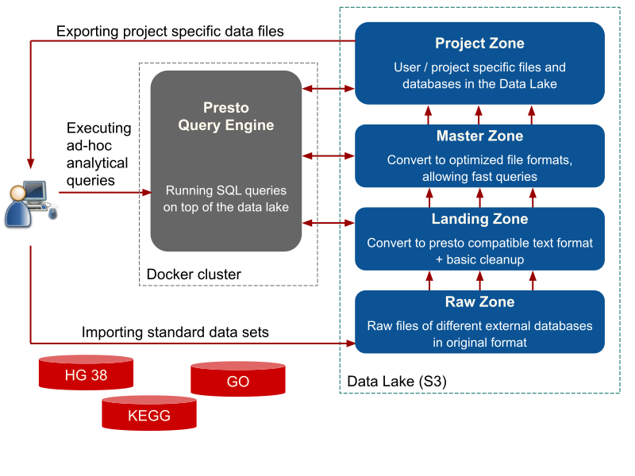

[BACK](./readme.md) to main page

# Basic components

Sherlock is using standard big data technologies to store the biological data and to analyze it. 
The main concept can be seen in the following figure (don’t be confused, every word on it will 
be explained later). Sherlock follows industrial best practices in its architecture. Usually 
the main idea behind these scalable batch processing architectures is the separation of 
data storage and analytics, as you can see below. This allows you to scale the analytical power 
and the storage size independently from each other and even dynamically, if you are deploying 
Sherlock in the cloud.

## Data Lake - where all the data is stored

In Sherlock, we store the data in a Data Lake. You can imagine the Data Lake as a simple network 
storage you can attach to everywhere. All the data you import into, transform in, or export from 
Sherlock will sit here as simple data files. The Data Lake can be on your own servers or you can 
hire it from cloud providers. The technologies in Sherlock are compatible with HDFS and S3 storage 
formats, but we decided to support only the later one in all of our examples, as S3 is more modern, 
easier to buy in Cloud. Although HDFS is an older standard, it has some very nice features allowing 
you better performance, but it is also much harder to setup and maintain and most probably you will 
not need its extra features.

S3 (aka. ‘Simple Storage Service’) is a standard remote storage API format, introduced first by Amazon. 
Nowadays you can purchase S3 storage as a service from all major cloud providers. You can get 1 TB 
of S3 storage on a monthly price of $20-30, depending on your access patterns and on which provider 
you choose. If you need the cloud only for Sherlock and you don’t need any other fancy cloud service, 
then we recommend you to start with Digital Oceans (www.digitalocean.com) as it is secure and stable, 
yet much cheaper than the more advanced Cloud providers (like Amazon AWS, Google Cloud or Microsoft Azure). 
You can also install S3 on your own servers, but you definitely don’t want to do that unless you 
have dedicated devops engineers who can spend months of their time to deploy and maintain it for you.

Having a storage is only one half of having an operational Data Lake. One can not stress enough how 
important is it to organize your data in a well defined ‘folder’ structure. Many Data Lake deployments 
become unusable after a few years just because nobody remembers what data is exactly stored in the 
thousands of folders, or what is the file format, who created the data. You can choose your own 
structure, one which helps you to keep the Data Lake organized, but we can also propose you a 
basic structure, a set of rules, based on a few Big Data projects we participated in. Our suggestion 
is to separate your data in the Data Lake into four different main folders, representing different 
stages of your data and different access patterns in the Data Lake. Inside each of these main folders 
you can create subfolders, and it is a good practice to incorporate the name of the data set, the data 
owner name, the creation date (or other version info), and the file formats somehow into the paths. We 
will give more details in the [following page](data_lake.md).

## Presto Query Engine - analyzing and transforming your data

The Query Engines (like Hive, Impala, Spark Sql or Presto) are distributed, mostly stateless and very 
scalable softwares, which can connect to your Data Lake, read and combine your data stored there and 
execute different analytical queries on your data. We are using Presto, as it has good performance 
and it is maybe the easiest to deploy and maintain.

With Presto, you can formalize analytical questions using SQL (Structured Query Language). SQL is the 
_de facto_ standard way to express simple queries on top of relational data. If you are not familiar 
with SQL, you can find many great tutorials on the web. 
(e.g. [tutorialspoint:sql](https://www.tutorialspoint.com/sql/index.htm) 
[tutorialspoint:presto](https://www.tutorialspoint.com/apache_presto/index.htm))

Presto can be started in multiple machines, and the presto instances can discover each other on the 
net, forming a cluster. If you are using Sherlock on a cloud, you can easily change the cluster size 
by adding more VMs when you need a larger cluster to execute more complex analytics, and you can simply 
shrink down your cluster or even turn it off when you don’t need it. Remember: all the data is stored 
in the Data Lake, so you won’t lose your biological database or previously saved analytical result when 
you terminate the Presto cluster. The only state needed to preserve for Presto is in the so called 
‘Metastore’ component. Here Presto stores the metadata about your folders in the Data Lake. In Sherlock 
we provide you simple scripts to save these metadata in the Data Lake when you want to make a backup or 
before you want to terminate your analytical cluster.

In Sherlock we developed a dockerized version of Presto (and the Metastore), making it cloud agnostic, 
so that you can install it to any cloud provider. All you need is some standard linux machines with 
docker pre-installed. Running Presto in docker also means that you don’t need to install and configure 
Presto manually and you can fire it up even on your laptop if needed. In the 
[deployment guide](deployment_guide.md) we will show how can you make a set of Linux VMs with docker 
installed, then start a distributed Presto cluster by using Sherlock on top of Digital Oceans.

---
© 2018, 2019 Earlham Institute ([License](./sherlock_license.md))